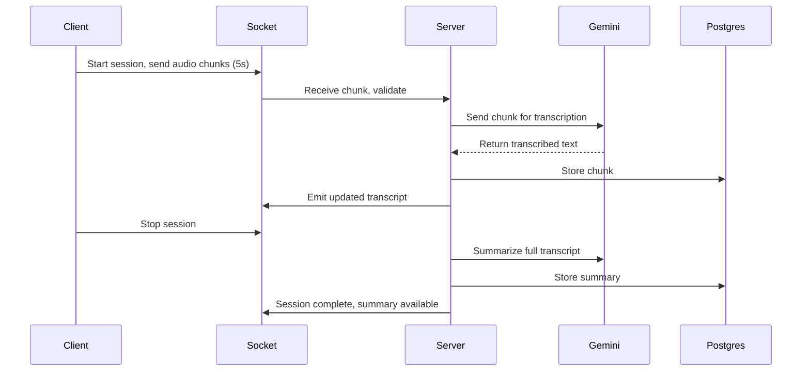

# Architecture Overview

## System Purpose

ScribeAI is a real-time meeting transcription web app that streams audio directly from the user’s mic or a browser tab, transcribes it using Google Gemini, and stores/transmits results live via Socket.io. It enables searchable transcripts with AI summaries after each session.

***

## How It Works

- **Frontend (Next.js app):**
  - User starts a recording (mic or tab audio prompt).
  - Audio is chunked (every 5 seconds) using the MediaRecorder API.
  - Each chunk is sent in real time through Socket.io to the backend.

- **Backend (Node.js server):**
  - Socket.io receives each chunk and validates the session/user.
  - Chunks are sent to Gemini via API for transcription (using audio/webm).
  - Transcripts are stored incrementally in Postgres, and live updates sent back to the client.
  - On stop, the whole transcript is summarized (using Vercel AI SDK + Gemini) and results stored in the session.

***

## Why This Design?

- **Chunk-based streaming over full upload:** Enables real-time feedback, resilience to network issues, and avoids memory spikes on long recordings.
- **Socket.io:** Used for low-latency bi-directional streaming, handling UI state, and sharing updates instantly.
- **Gemini AI:** Selected for accurate, robust transcription and summary via API, as required by the assignment.
- **PostgreSQL:** Used for reliable session and transcript storage and search/history.
- **State Management:** Zustand (frontend) keeps only essential state for performance and simple React integration.

***

## Component Flow

***

## Architecture Decisions

### Streaming vs Upload Comparison

| Aspect | **Real-time Streaming** (Implemented) | Post-Recording Upload |
|--------|----------------------------------------|----------------------|
| **Latency** | Low (2-5s per chunk) | High (waits for full recording) |
| **User Experience** | Live transcription during meeting | Transcript only after meeting ends |
| **Memory Usage** | Efficient (5s chunks, ~50KB each) | High (full audio in memory) |
| **Reliability** | Resilient (chunk-level retry) | Fails if upload interrupted |
| **Scalability** | Better (distributed processing) | Poor (large file transfers) |
| **Network** | Requires stable WebSocket | Works with intermittent connection |
| **Error Recovery** | Lose only 5s of audio max | Lose entire recording on failure |

**Why We Chose Streaming:**
1. **User Value** - Live transcription provides immediate value during meetings, enabling real-time reference and corrections
2. **Technical Robustness** - Chunked processing isolates failures and enables granular retry logic
3. **Scalability** - Server memory stays constant regardless of recording duration (processes ~50KB at a time vs. potentially GB-sized files)

### Technology Choices

| Decision | Choice | Rationale |
|----------|--------|-----------|
| **Streaming Protocol** | Socket.io | Bi-directional real-time communication, automatic reconnection, room-based broadcasting for multi-user support |
| **Audio Format** | WebM/Opus | Browser-native MediaRecorder output, efficient compression (~10KB/s), Gemini API compatible |
| **AI Provider** | Google Gemini 2.5 Flash | Assignment requirement, fast inference (<2s), native audio support, affordable at $0.075/1M tokens |
| **Database** | PostgreSQL + Prisma | Assignment requirement, ACID compliance for session integrity, excellent TypeScript integration |
| **Chunk Size** | 5 seconds | Balances latency (user sees text quickly) vs. API costs (fewer calls) vs. accuracy (enough context for Gemini) |
| **Frontend Framework** | Next.js 14 App Router | Server-side rendering for auth, API routes for backend integration, modern React features |
| **State Management** | Zustand | Lightweight (1KB), simple API, perfect for recording state (status, chunks, transcripts) |

---

## Long-Session Scalability Analysis

### Design for 1-Hour Recordings

**Challenge:** How do you handle 3600 seconds of audio without memory overload, database bottlenecks, or user interface lag?

**Our Approach:**

**1. Chunked Streaming Architecture**  
Every 5 seconds, MediaRecorder produces ~50KB WebM chunks sent via Socket.io. This results in 720 chunks for a 1-hour session (~36MB total data transfer). Server processes each chunk independently—after Gemini transcription (~500ms) and database write (~50ms), the chunk is garbage collected. Peak server memory: <5MB per concurrent session.

**2. Database Write Optimization**  
Instead of single INSERT after recording, we write 720 small rows incrementally. Postgres handles this efficiently with btree indexes on `(sessionId, chunkIndex)` composite keys. Database load distributes over 1 hour instead of spiking at the end. For 10 concurrent users: ~7200 writes/hour = 2 writes/second (well within Postgres's 10K+ writes/sec capacity).

**3. Client-Side Memory Management**  
Zustand store holds only the *current* chunk in memory. After Socket.io transmission, the audio blob is dereferenced and garbage collected. UI displays transcript incrementally via React virtualization (only renders visible rows). Result: Client memory stays flat at ~20MB regardless of recording duration.

**4. Concurrency Scaling**  
Each Socket.io connection is an isolated Node.js event loop. With 512MB RAM per instance, we estimate 50-100 concurrent sessions before vertical scaling. Horizontal scaling via Redis adapter for Socket.io rooms enables 1000+ concurrent users across multiple server instances.

**5. Bottlenecks & Mitigation**
- **Gemini API Rate Limits:** 1500 requests/minute = 25 req/s. For 50 users @ 5s chunks = 10 req/s Safe
- **WebSocket Connections:** Default 1024 file descriptors. Increase via `ulimit` or use NGINX as WebSocket proxy
- **Database Throughput:** Single Postgres instance handles ~5K queries/s. Our load: ~50 req/s at scale Safe

**Trade-offs:**
- Requires persistent WebSocket (fails on mobile network switches)
- More complex error handling (must track 720 chunks vs. 1 file)
- Superior UX (users see transcripts live, not after 1 hour)
- Resilience (5s chunk failure doesn't lose entire session)

---

## Summary

This architecture enables reliable, real-time transcription and search for professionals. The chunked streaming approach combined with live WebSocket communication maximizes user experience and efficiency for long-duration or multi-user meetings, keeping the system scalable and maintainable.

***
